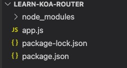
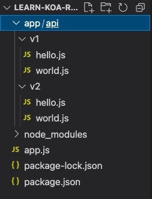
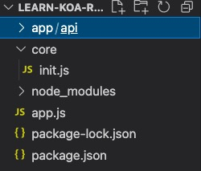

# koa 路由保姆级教程

时间：2021 年 09 月 11 日  
作者：吴业飞

---

在这个系列里，我会从零开始搭建项目，完整展示如何从最基础的路由写法到最佳实践的改造过程。你会看到从把所有路由都写在 app.js 里的写法到把路由抽离出来，再到路由自动引入及自动注册的全过程。

# 项目搭建

## 前期准备

新建文件夹 learn-koa-router  
新建文件 app.js  
初始化 npm: `npm init`  
下载 koa:`npm install koa`

项目目录现在长这样

## 先把服务器跑起来

    // app.js
    const Koa = require('koa')

    const app = new Koa();

    app.listen(3001)
    console.log('listen 3001');

## 最基础的路由写法

现在先不使用 koa-router,我们回归最基础的路由写法

    // app.js
    const Koa = require('koa')

    const app = new Koa();
    app.use(async (ctx, next) => {
        if (ctx.path === '/hello/router' && ctx.method === 'GET') {
            ctx.body = {
                key: "hello world"
            }
        }
    })
    app.listen(3001)
    console.log('listen 3001');

写完后终端里执行`node app.js`，然后去浏览器访问`http://localhost:3001/hello/router`(或者使用 postman 请求)，看到我们成功的返回了

    {"key":"hello world"}

## 使用 koa-router

可以看到，不使用 koa-router 我们一样能处理路由，但是我们需要自己处理的逻辑会比较多，所以在生产环境我们还是选择使用优秀的轮子，这里我们看看使用 koa-router 应该怎么写

下载 koa-router: `npm install koa-router`  
改写`app.js`

    // app.js
    const Koa = require('koa')
    const Router = require('koa-router')
    const app = new Koa();
    const router = new Router()
    router.get('/hello/router', (ctx, next) => {
        ctx.body = {
            key: "hello koa-router"
        }
    })
    app.use(router.routes())
    app.listen(3001)
    console.log('listen 3001');

写完后终端里执行`node app.js`，然后去浏览器访问`http://localhost:3001/hello/router`(或者使用 postman 请求)，看到我们成功的返回了

    {"key":"hello koa-router"}

## 路由拆分

理论上我们现在已经可以在 app.js 里写我们所有需要的路由，项目可以跑起来，但是这样并不优雅。路由全写 app.js 里，导致 app.js 这个文件很臃肿，难维护，不易读。所以我们考虑把路由专门找个地方放。修改下项目目录

注意到我们有 v1 和 v2 两个文件夹，这里是考虑到对 api 的版本做个区分，方便做新老数据兼容。这里的 v1 和 v2 代表我们的 api 版本号。关于 api 版本的区分我们后面有机会还可以再仔细聊聊，这里讲路由拆分的话可以暂时不用关注这个版本区分，我这里这样建文件夹是按照正规生产环境搭建，埋个伏笔。

hello.js

    // hello.js
    const Router = require('koa-router')
    const router = new Router();
    router.get('/v1/hello/router', (ctx, next) => {
        ctx.body = {
            key: "hello koa-router v1"
        }
    })
    module.exports = router;

world.js

    // world.js
    const Router = require('koa-router')
    const router = new Router();
    router.get('/v1/world/router', (ctx, next) => {
        ctx.body = {
            key: "world v1"
        }
    })
    module.exports = router;

app.js

    // app.js
    const Koa = require('koa')
    const hello = require('./app/api/v1/hello')
    const world = require('./app/api/v1/world')
    const app = new Koa();

    app.use(hello.routes())
    app.use(world.routes())
    app.listen(3001)
    console.log('listen 3001');

写完后终端里执行`node app.js`，然后去浏览器访问`http://localhost:3001/v1/hello/router`(或者使用 postman 请求)，看到我们成功的返回了

    {"key":"hello koa-router v1"}

这里看到，我们请求的是`http://localhost:3001/v1/hello/router`,url 里是加上了 v1 的，这里就是 api 版本放到 url 里的写法，同理我们以后也可以请求`/v2/hello/router`,`/v3/hello/router`。没忍住，又扯到 api 版本上去了，我们拉回来说路由的事。  
经过我们的抽离，我们现在做到了每个路由模块都写在专门的文件里，app.js 里只是引用和注册路由，整洁了许多。但是我们还不能止步于此，还有优化空间。  
可以预见的是，如果我们有几百个 api,我们需要手动一个一个 require 进 app.js 还要手动 app.use 注册，太累了，不想"偷懒"的程序员不是好程序员,我们要让程序自动实现引入和注册！

## 自动导入路由与自动注册

自动导入的原理很简单，就是寻找`app/api/v1`下的所有文件然后 require 进 app.js,这个逻辑可以自己写，但我们选择用轮子`require-directory`。  
下载 require-directory：`npm install require-directory`  
改写 app.js

    // app.js
    const Koa = require('koa')
    const Router = require('koa-router')
    const requireDirectory = require('require-directory')
    const app = new Koa();
    const apiDirectory = `${process.cwd()}/app/api` // 拼接绝对路径

    function whenLoadModule(obj) {
        if (obj instanceof Router) {
            app.use(obj.routes())
        }
    }

    requireDirectory(module, apiDirectory, {
        visit: whenLoadModule
    })
    app.listen(3001)
    console.log('listen 3001');

写完后终端里执行`node app.js`，然后去浏览器访问`http://localhost:3001/v1/hello/router`(或者使用 postman 请求)，看到我们成功的返回了

    {"key":"hello koa-router v1"}

这里解释下代码，requireDirectory 用到了 3 个参数，第一个 module 可以简单理解为写死的（想多了解点可以去官网看更多介绍），第二个 apiDirectory 就是文件夹路径，可以是相对路径也可以是绝对路径，我这里拼了绝对路径，方便以后移动代码不用再改路径，需要 require 哪个目录的文件，这里的路径就写哪个文件夹的路径；第 3 个参数里的 whenLoadModule 方法可以简单理解为回调函数，requireDirectory 方法每引入一个模块都会调用一下这个回调函数，引入的模块会传到回调函数里，还记得我们的路由是怎么写的么

    // app/api/v1/hello.js
    const Router = require('koa-router')
    const router = new Router();
    router.get('/v1/hello/router', (ctx, next) => {
        ctx.body = {
            key: "hello koa-router v1 自动"
        }
    })
    module.exports = router;

由于我们在 hello.js 导出的就是 router 实例，所以我们的 whenLoadModule 方法接受的 obj 参数就是这里的 router 实例。

至此，我们实现了路由的自动导入和引用，以后我们可以专心在 app/api/v1 里写路由，不用再改 app.js 文件就能让路由自己生效，是不是很棒！

别急，不知不觉我们的 app.js 里的逻辑又多起来了，我们说 app.js 作为一个入口文件应该有入口文件的样子，这些路由逻辑可以认为是初始化操作，以后还会有更多的逻辑，所以我们再改改代码，把初始化的逻辑抽出来。

## 初始化管理器

新建文件夹 core,新建文件 core/init.js

init.js

    // core/init.js
    const requireDirectory = require('require-directory')
    const Router = require('koa-router')
    class InitManager {
        static initCore(app) {
            // 入口方法
            InitManager.app = app;
            InitManager.initLoadRouters();
        }
        static initLoadRouters() {
            function whenLoadModule(obj) {
                if (obj instanceof Router) {
                    InitManager.app.use(obj.routes())
                }
            }
            const apiDirectory = `${process.cwd()}/app/api` // 拼接绝对路径
            requireDirectory(module, apiDirectory, {
                visit: whenLoadModule
            })
        }
    }

    module.exports = InitManager;

app.js

    // app.js
    const Koa = require('koa')
    const InitManager = require('./core/init')
    const app = new Koa();
    InitManager.initCore(app)
    app.listen(3001)
    console.log('listen 3001');

写完后终端里执行`node app.js`，然后去浏览器访问`http://localhost:3001/v1/hello/router`(或者使用 postman 请求)，看到我们成功的返回了

    {"key":"hello koa-router v1"}

# 总结

现在我们的路由架构真正搭建完成了。从把所有路由都写在 app.js 里到把路由抽离出来，再到路由自动引入及自动注册。这个折腾的过程也是我的探索过程，理论上把所有路由都写在 app.js 里项目能跑，但是我们不能仅仅满足于能用这个层次，还得好用。多多思考怎么"偷懒"我们才能提升我们的水平，我们设计出来的架构才能让别人拍手称赞。

---

版权声明：自由转载-非商用-非衍生-保持署名
