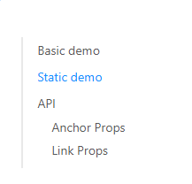

- [锚点目录](#锚点目录)
  - [实际问题](#实际问题)
  - [各个击破](#各个击破)
    - [哈希路由与锚点冲突问题](#哈希路由与锚点冲突问题)
    - [如何判断高亮哪一个锚点](#如何判断高亮哪一个锚点)
    - [如何处理滚动区域嵌套问题](#如何处理滚动区域嵌套问题)


# 锚点目录
Anchor锚点用于跳转到页面指定位置。如果使用antd的锚点组件可以轻易得到这样的UI效果  

  

主要特性为点击锚点可以跳转到页面指定位置；  
页面滚动时锚点会根据当前位置高亮显示；
## 实际问题
项目情况往往比想象的复杂，比如  
- 项目是单页面应用，使用哈希路由，已经使用#做路由了，与锚点冲突了怎么办？antd锚点组件基于#锚点,在哈希路由下无法使用
- 一行不止一个锚点，如果判断高亮哪一个锚点？
- 滚动区域各种嵌套


## 各个击破
虽然antd的锚点组件在哈希路由下无法工作，但是我们还是可以利用他的组件，只不过自己实现滚动和高亮的逻辑
### 哈希路由与锚点冲突问题
其实这里只是影响点击锚点自动滚动到锚点位置而已，所以我们可以自己实现点击锚点滚动到指定位置的功能
基于antd的Anchor组件实现onClick方法handleAnchorClick
```
private handleAnchorClick = (e, link) => {
    e.preventDefault()
    const element = document.getElementById(link.href)
    element.scrollIntoView({
      behavior: 'smooth'
    })
  }
```
这几行代码即可实现点击锚点滚动到指定位置的功能
### 如何判断高亮哪一个锚点
这里面的坑有点多，我们一步步来解决。  
最初思路为，统一交给滚动监听，将靠近上部的锚点高亮即可，我们可以使用IntersectionObserver来实现initAnchor方法
```
// 锚点监听start
if (this._observer) {
    // 因为在渲染过程中initAnchor频繁触发，所以先清空之前的监听器，再重新初始化新的监听器
    this._observer = null
}
const options = {
    root: document.getElementById('scrollDom'),
    rootMargin: '0px 0px -70% 0px',
    threshold: [0]
}
this._observer = new IntersectionObserver((entries) => {
// 取所有当前可见的entries（可能有多个），选取页面上最靠上的那个
let visible = entries.filter((e) => e.isIntersecting)
if (visible.length) {
    // 按页面垂直坐标排序，选择最上面的
    visible.sort(
    (a, b) =>
        a.target.getBoundingClientRect().top -
        b.target.getBoundingClientRect().top
    )
    const href = visible[0].target.attributes.href.value
    this.currentAnchor = href
}
}, options)
anchors.forEach((anchor) => this._observer.observe(anchor))
// 锚点监听end
```
这样实现了锚点进入页面上方30%位置就触发回调，设置this.currentAnchor，antd的Anchor组件会根据this.currentAnchor来判断哪一个锚点高亮，传入Anchor组件,实现滚动高亮
```
getCurrentAnchor={() => {
    return this.currentAnchor
}}
```  
但是这里有个问题，如果一行不止一个锚点，如何判断哪一个锚点高亮？这里我们的处理方式是高亮最上面的第一个锚点。这样处理又带来了一个问题，就是如果是点击锚点触发的滚动，如果点的是一行中的第二个锚点，那么高亮的就是第一个。对用户来说点击的锚点和高亮的锚点不一致，体验不好。  

所以我们要修改点击事件以及滚动回调逻辑，在点击锚点时，以点击高亮为准（将锚点的href赋值给this.currentAnchor）同时暂时屏蔽滚动时设置高亮的逻辑，在滚动结束后再将设置高亮权交还给滚动回调。
```
 private handleAnchorClick = (e, link) => {
    e.preventDefault()
    const element = document.getElementById(link.href)

    this.ignoreObserver = true // 点击锚点时忽略IntersectionObserver的监听器，防止锚点点击后，锚点高亮后又消失的问题
    element.scrollIntoView({
      behavior: 'smooth'
    })
    this.currentAnchor = link.href.split('#')[1]
  }
```
```
// 锚点监听start

const options = {
    root: document.getElementById('scrollDom'),
    rootMargin: '0px 0px -70% 0px',
    threshold: [0]
}
this._observer = new IntersectionObserver((entries) => {
// 取所有当前可见的entries（可能有多个），选取页面上最靠上的那个
let visible = entries.filter((e) => e.isIntersecting)
if (visible.length) {
    // 按页面垂直坐标排序，选择最上面的
    visible.sort(
    (a, b) =>
        a.target.getBoundingClientRect().top -
        b.target.getBoundingClientRect().top
    )
    const href = visible[0].target.attributes.href.value
    if (!this.ignoreObserver) { // 如果是点击锚点触发的滚动，以点击的高亮为准
    this.currentAnchor = href
    }
}
}, options)
anchors.forEach((anchor) => this._observer.observe(anchor))
// 锚点监听end
``` 
### 如何处理滚动区域嵌套问题
这个利用antd的Anchor组件的属性getContainer即可解决
```
<Anchor
    affix={true}
    onClick={(e, link) => this.handleAnchorClick(e, link)}
    getContainer={() => {
        return document.getElementById('scrollDom')
    }}
    getCurrentAnchor={() => {
        return this.currentAnchor
    }}
>
    {this.anchorsList.length > 0 &&
    this.anchorsList.map((item, index) => {
        return item
    })}
</Anchor>
```
